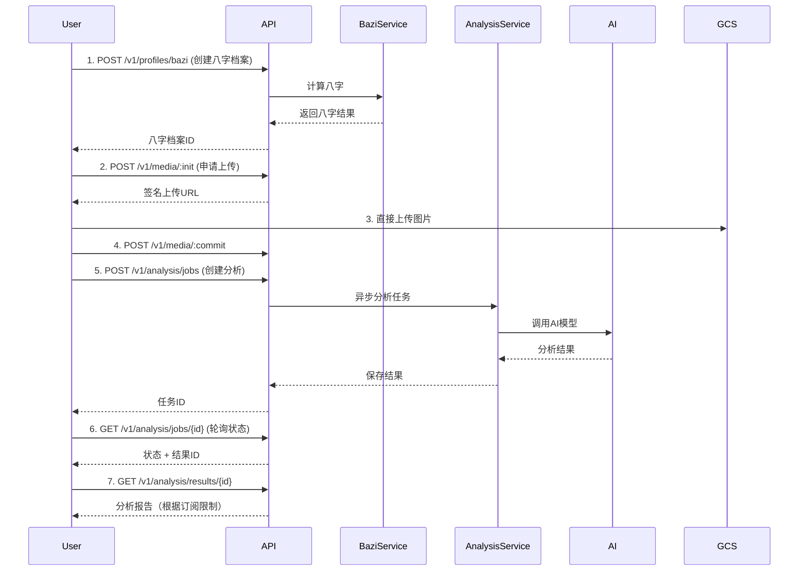

# Octa Backend API 完整概览

## 基础信息

- **Base URL**: `https://api.octa.ai` (生产环境) 或 `http://localhost:8000` (开发环境)
- **API Version**: v1
- **认证方式**: Bearer Token (JWT)
- **响应格式**: JSON

## API端点总览

### 健康检查

| 方法 | 路径 | 描述 | 认证 |
|------|------|------|------|
| GET | `/healthz` | 存活检查 | 否 |
| GET | `/readyz` | 就绪检查 | 否 |

### 1. 认证 (`/v1/auth`)

| 方法 | 路径 | 描述 | 状态 |
|------|------|------|------|
| POST | `/register` | 注册新用户 | ✅ 已实现 |
| POST | `/verify` | 验证邮箱 | ✅ 已实现 |
| POST | `/login` | 邮箱密码登录 | ✅ 已实现 |
| POST | `/login-oauth` | OAuth登录（Google/Apple） | 🚧 占位 |
| POST | `/logout` | 登出 | ✅ 已实现 |
| POST | `/refresh` | 刷新访问令牌 | ✅ 已实现 |

### 2. 用户管理 (`/v1/users`)

| 方法 | 路径 | 描述 | 状态 |
|------|------|------|------|
| GET | `/me` | 获取当前用户信息 | ✅ 已实现 |
| PATCH | `/me` | 更新用户资料 | ✅ 已实现 |
| POST | `/me/deletion` | 请求删除账号 | ✅ 已实现 |
| GET | `/me/deletion` | 查询删除进度 | ✅ 已实现 |
| DELETE | `/me/deletion` | 撤回删除请求 | ✅ 已实现 |

### 3. 八字档案 (`/v1/profiles`)

| 方法 | 路径 | 描述 | 状态 |
|------|------|------|------|
| POST | `/bazi` | 创建八字档案 | ✅ 已实现 |
| GET | `/bazi` | 获取档案列表 | ✅ 已实现 |
| GET | `/bazi/{id}` | 查看档案详情 | 🚧 占位 |
| PATCH | `/bazi/{id}` | 修改档案 | 🚧 占位 |
| DELETE | `/bazi/{id}` | 删除档案 | 🚧 占位 |
| POST | `/bazi/{id}:activate` | 切换档案 | 🚧 占位 |

### 4. 媒体管理 (`/v1/media`)

| 方法 | 路径 | 描述 | 状态 |
|------|------|------|------|
| POST | `/:init` | 申请上传URL | ✅ 已实现 |
| POST | `/:commit` | 确认上传完成 | ✅ 已实现 |
| GET | `/{media_id}` | 获取下载URL | ✅ 已实现 |
| DELETE | `/{media_id}` | 删除媒体 | ✅ 已实现 |
| POST | `/sets` | 创建媒体集（环扫） | ✅ 已实现 |
| GET | `/sets/{set_id}` | 获取媒体集 | 🚧 占位 |

### 5. 风水分析 (`/v1/analysis`) ⭐️ 核心功能

| 方法 | 路径 | 描述 | 状态 |
|------|------|------|------|
| POST | `/jobs` | 创建分析任务 | ✅ 已实现 |
| GET | `/jobs/{job_id}` | 查询任务状态 | ✅ 已实现 |
| GET | `/results/{result_id}` | 获取分析结果 | ✅ 已实现 |

**支持的场景类型**:
- `workspace`: 工位风水分析 (MVP重点)
- `floorplan`: 户型风水分析 (待实现)
- `lookaround8`: 八方环扫分析 (待实现)

### 6. 报告管理 (`/v1/reports`)

| 方法 | 路径 | 描述 | 状态 |
|------|------|------|------|
| GET | `/` | 列出用户报告 | ✅ 已实现 |
| GET | `/{report_id}` | 查看报告详情 | ✅ 已实现 |
| DELETE | `/{report_id}` | 删除报告 | ✅ 已实现 |
| POST | `/{report_id}/share` | 生成分享链接 | ✅ 已实现 |
| DELETE | `/{report_id}/share` | 撤销分享 | ✅ 已实现 |
| GET | `/shared/{share_token}` | 访问分享报告 | ✅ 已实现 |

### 7. 订阅管理 (`/v1/entitlements`)

| 方法 | 路径 | 描述 | 状态 |
|------|------|------|------|
| GET | `/me` | 获取订阅状态 | ✅ 已实现 |
| POST | `/refresh` | 刷新订阅状态 | ✅ 已实现 |
| GET | `/offerings` | 获取可用订阅 | ✅ 已实现 |
| POST | `/webhooks/revenuecat` | RevenueCat回调 | 🚧 占位 |
| POST | `/webhooks/stripe` | Stripe回调 | 🚧 占位 |

## 认证流程

### 1. 注册和登录

```bash
# 1. 注册
POST /v1/auth/register
{
  "email": "user@example.com",
  "password": "SecurePass123",
  "language": "zh",
  "timezone": "Asia/Shanghai"
}

# 2. 验证邮箱
POST /v1/auth/verify
{
  "token": "verification_token_from_email"
}

# 3. 登录
POST /v1/auth/login
{
  "email": "user@example.com",
  "password": "SecurePass123"
}

# 响应
{
  "access_token": "eyJ...",
  "refresh_token": "eyJ...",
  "token_type": "Bearer",
  "expires_in": 900
}
```

### 2. 使用令牌

```bash
# 在所有需要认证的请求中添加 Header
Authorization: Bearer {access_token}
```

### 3. 刷新令牌

```bash
POST /v1/auth/refresh
{
  "refresh_token": "eyJ..."
}
```

## 核心业务流程

### 工位风水分析完整流程



## 数据模型

### Bazi Profile (八字档案)

```json
{
  "profile_id": "bazi_xxx",
  "name": "张三",
  "birth_date": "1990-05-15",
  "birth_time": "14:30:00",
  "birth_location": "北京市",
  "gender": "male",
  "chart": {
    "year_pillar": {
      "heavenly_stem": "庚",
      "earthly_branch": "午",
      "element": "metal"
    },
    "month_pillar": {...},
    "day_pillar": {...},
    "hour_pillar": {...},
    "day_master": "己",
    "elements": {
      "wood": 20.0,
      "fire": 30.0,
      "earth": 25.0,
      "metal": 15.0,
      "water": 10.0
    }
  },
  "lucky_elements": ["fire", "earth"],
  "lucky_directions": ["south", "center"],
  "lucky_colors": ["red", "yellow"]
}
```

### Analysis Result (分析结果)

```json
{
  "result_id": "result_xxx",
  "overall_score": 75,
  "summary": "工位风水整体良好...",
  "details": {
    "desk_position": {
      "score": 70,
      "description": "...",
      "issues": [...]
    },
    "element_balance": {
      "current_elements": {...},
      "compatibility_score": 65,
      "missing_elements": ["fire"],
      "excess_elements": ["wood"]
    },
    "energy_flow": {
      "score": 80,
      "positive_aspects": [...],
      "negative_aspects": [...]
    }
  },
  "recommendations": [
    {
      "category": "placement",
      "priority": "high",
      "title": "添加背后支撑",
      "description": "...",
      "expected_improvement": "..."
    }
  ]
}
```

## 订阅等级和限制

### Free Tier (免费)

- ✅ 3次工位分析/月
- ✅ 基础报告
- ✅ 1个八字档案
- ❌ 无聊天功能
- ❌ 无详细分析

### Pro Tier (专业版)

- ✅ 无限次分析
- ✅ 完整详细报告
- ✅ AI聊天助手
- ✅ PDF导出
- ✅ 优先处理
- ✅ 最多5个八字档案

## 错误响应格式

```json
{
  "error": {
    "code": "VALIDATION_ERROR",
    "message": "用户友好的错误信息",
    "details": {
      "field": "email",
      "reason": "invalid_format"
    }
  }
}
```

### 常见错误码

| 状态码 | 错误码 | 描述 |
|--------|--------|------|
| 400 | VALIDATION_ERROR | 请求验证失败 |
| 401 | UNAUTHORIZED | 未认证 |
| 401 | INVALID_CREDENTIALS | 凭证无效 |
| 401 | TOKEN_EXPIRED | 令牌过期 |
| 403 | FORBIDDEN | 无权限 |
| 403 | SUBSCRIPTION_REQUIRED | 需要订阅 |
| 403 | QUOTA_EXCEEDED | 配额超限 |
| 404 | NOT_FOUND | 资源不存在 |
| 409 | CONFLICT | 资源冲突 |
| 429 | RATE_LIMIT_EXCEEDED | 速率限制 |
| 500 | INTERNAL_ERROR | 服务器错误 |

## 速率限制

| 端点 | 限制 |
|------|------|
| 标准API | 60次/分钟 |
| 分析任务 | 5次/小时 (免费) |
| 分析任务 | 无限制 (Pro) |
| 登录尝试 | 10次/小时 |

## 开发指南

### 本地运行

```bash
# 使用开发脚本
./run_dev.sh

# 或手动运行
python app/main.py
```

### 测试API

```bash
# 健康检查
curl http://localhost:8000/healthz

# 注册用户
curl -X POST http://localhost:8000/v1/auth/register \
  -H "Content-Type: application/json" \
  -d '{"email":"test@example.com","password":"Test1234"}'

# 查看API文档
open http://localhost:8000/docs
```

## 部署

### 环境变量

必需的环境变量请参考 `.env.example` 文件。

### Docker部署

```bash
docker build -t octa-backend .
docker run -p 8000:8000 --env-file .env octa-backend
```

### Cloud Run部署

```bash
gcloud run deploy octa-backend \
  --image gcr.io/octa-v1/backend \
  --platform managed \
  --region asia-southeast1 \
  --allow-unauthenticated
```

## 未来扩展

### 计划功能

- [ ] 聊天功能 (`/v1/chat`)
- [ ] 户型分析管道
- [ ] 环扫分析管道
- [ ] 历史趋势分析
- [ ] PDF报告生成
- [ ] 通知系统
- [ ] 管理后台API

### 优化计划

- [ ] Redis缓存集成
- [ ] 数据库连接池
- [ ] 异步任务队列 (Cloud Tasks/Pub/Sub)
- [ ] CDN集成
- [ ] 性能监控
- [ ] 日志聚合